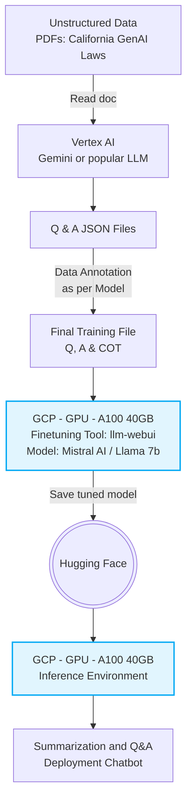

# Meet Review 1: California GenAI Regulatory Reasoning Model

## Objective  
The meeting focused on developing a compliant and high-performance reasoning-capable AI model tailored exclusively for Regulatory Laws in GenAI for the state of California. The target model is Ministral-3-8B-Reasoning-2512 (a reasoning post-trained variant from Mistral AI, optimized for complex multi-step reasoning tasks).  

## Key Priorities  
- Ensuring full transparency in training data and model modifications to comply with California’s Generative Artificial Intelligence Training Data Transparency Act (AB 2013).  
- Shifting the model from basic text generation to advanced multi-step regulatory reasoning.  
- Establishing a secure, efficient fine-tuning pipeline optimized for GenAI regulatory compliance use cases.

---

## 1. Regulatory Compliance – California GenAI Regulatory Landscape
California has enacted a broad and rapidly evolving suite of generative AI laws that companies operating in the state must now navigate in parallel. While AB 2013 remains the primary compliance obligation governing training data transparency, the following laws collectively define the current regulatory environment and carry distinct obligations, deadlines, and liability structures.

### 1.1 AB 2013, Generative AI Training Data Transparency Act (Primary Obligation)
California's AB 2013 mandates that developers of generative AI systems made available to Californians publish detailed, high-level documentation about training datasets on their website. This applies to any system released or substantially modified (including fine-tuning or retraining) on or after January 1, 2022.
**Key obligations:**
- Provide a high-level summary of all datasets used, including sources and owners, types/categories of data and volume, collection and processing methods, use of copyrighted materials, personal information or synthetic data, and how each dataset contributes to model performance.
- Documentation must be posted publicly before making the system available in California and updated for any substantial modifications.
- Applies to "developers" responsible for creating, fine-tuning, or significantly altering generative AI systems.
- Maintain comprehensive records of every stage of modification, continual pre-training, supervised fine-tuning, and data synthesis, to fulfill disclosure obligations.

### 1.2 SB 942 / AB 853, California AI Transparency Act (CAITA)
AB 853 amends CAITA and expands obligations for "covered providers", defined as those who create or produce a GenAI system with over one million monthly users accessible within California. Covered providers must:
- Make a free public AI detection tool available.
- Offer users the option to include manifest disclosures in AI-generated content.
- Embed latent disclosures in that content.
*Non-compliance carries a civil penalty of $5,000 per violation plus attorneys' fees.*

### 1.3 AB 489, Healthcare AI Deceptive Terms Act
Prohibits AI systems and related technologies from using terms, letters, or phrases that imply a user is receiving care from a licensed healthcare professional when no such human oversight exists. The prohibition extends to advertising and product functionality. Both developers and deployers are held liable for violations.

### 1.4 AB 316, AI Liability / No Autonomous Harm Defense
Applies broadly to any civil action where AI involvement is alleged to have caused damage. Developers and deployers are prohibited from using an "autonomous harm" defense, meaning liability cannot be avoided simply by attributing harm to the AI system itself rather than to the humans or organizations behind it.

### 1.5 AB 325, Preventing Algorithmic Price Fixing Act
Strengthens antitrust oversight by prohibiting the use or distribution of AI-driven "common pricing algorithms" to align or coerce pricing across market participants. The act also lowers the pleading standard for civil claims brought under the Cartwright Act, increasing litigation exposure for AI-adjacent pricing tools.

### 1.6 SB 243, Companion Chatbots Act
Targets conversational AI products with a relational or companionship function. Mandates:
- Chatbot transparency disclosures to users.
- Safety protocols preventing the generation of suicidal or otherwise harmful content.
- Specific protections for minors, including content restrictions and inactivity/break reminders.

### 1.7 California Transparency in Frontier AI Act (TFAIA)
Part of a broader state-level AI regulatory framework, TFAIA imposes transparency requirements on frontier AI systems. Companies should track implementation guidance closely as the Act intersects with several of the obligations above.

---

## 2. Infrastructure & Environment Setup  
- **Cloud Resources:** Leverage Google Cloud Platform (GCP). Utilize GCP free credits specifically allocated for the Chain-of-Thoughts computational workload.  
- **Compute:** Set up the GPU environment directly on Jupyter Notebooks for all fine-tuning processes.  
- **Reference Material:** Use resources and code from the “Mistral Fine-Tuning Bootcamp” to establish the baseline setup.

> **Note on Tooling Constraints:** Fine-tuning needs to be executed using the tool available at [github.com/wangermeng2021/llm-webui](https://github.com/wangermeng2021/llm-webui). If this specific tool does not fully support the required reasoning capabilities for Ministral-3-8B-Reasoning, the architecture permits a fallback to **Llama 7b Instruct**.

---

## 3. High Level Solution Architecture
The following flowchart illustrates the end-to-end data processing and model fine-tuning pipeline required to deploy the regulatory chatbot on GCP:

---

## 4. Data Strategy & Preparation  
- **Source Data:** Primary dataset consists exclusively of PDF sample data covering GenAI regulatory laws in California (including AB 2013 and related statutes).  
- **Data Formatting:**  
  – Convert into structured Instruction (Question & Answer) format.  
  – Include a mandatory Reasoning layer in every example: `Question → Thought Process / Reasoning → Answer`.  
- **Data Mapping:** Build a structured mapping of all regulatory rules to ensure the training data accurately reflects legal requirements.  
- **Scenario Planning:** Implement COP (Chain of Scenarios) to simulate various GenAI regulatory compliance situations.

---

## 5. Model Training Strategy (Phased Approach)  
- **Phase 1 – Concept Building (3B Model):** Begin training on the smaller 3B parameter variant to rapidly validate the full pipeline and establish foundational regulatory understanding.  
- **Phase 2 – Advanced Reasoning (8B Model):** Once the 3B model is validated, scale up to the full Ministral-3-8B-Reasoning-2512 model.  

**Training Pipeline:**  
- Perform **Continual Pre-Training (CPT)** for domain adaptation to California GenAI regulations.  
- Execute **Supervised Fine-Tuning (SFT)** with explicit focus on the reasoning-extraction layer.  
- **Checkpointing Strategy:** Train incrementally and save checkpoints progressively (e.g., after 1,000 PDFs, 2,000 PDFs, etc.) for stability and recovery.

---

## 6. Evaluation & Final Deliverables  
- **Metrics Tracking:** Closely monitor Train Loss and Accuracy throughout the SFT process to confirm the model is correctly learning regulatory mapping and reasoning.  
- **Final Product Output:** Deliver a chatbot interface that provides:  
  – The final answer.  
  – An explicit Reasoning Section showing the model’s step-by-step thought process grounded in California GenAI regulations.

---

## 7. Next Steps & Action Items  
- [ ] Initialize and configure the GCP Jupyter environment using free credits.  
- [ ] Begin synthesis of CoT-enhanced dataset from California GenAI regulatory PDFs.  
- [ ] Validate the full pipeline first on the 3B model.  
- [ ] Document all data sources, processing steps, and modifications for immediate AB 2013 transparency disclosure.  
- [ ] Schedule follow-up to review 3B model results and pipeline stability.

---

## Deliverables / Outcomes Expected

### 1. Prepared Regulatory Dataset
A clean, structured dataset derived from California GenAI regulatory PDFs, formatted in an Instruction-tuning schema (`Question → Reasoning → Answer`). This includes a completed regulatory rules mapping document and a Chain-of-Scenarios (COP) library simulating real-world compliance situations.

### 2. Phase 1 - Validated 3B Fine-Tuned Model
A fine-tuned 3B parameter Mistral model that demonstrates foundational understanding of California GenAI regulations, serving as proof-of-concept for the training pipeline and data formatting approach.

### 3. Phase 2 - Production-Ready 8B Fine-Tuned Model
A fine-tuned 8B parameter Mistral model trained via CPT (if required) and SFT, with explicit reasoning-layer extraction capabilities. Incremental checkpoints saved at defined dataset milestones (1,000 PDFs, 2,000 PDFs, etc.) to ensure training stability and recoverability.

### 4. Training Performance Report
A documented record of Train Loss and Accuracy metrics across both model phases, providing visibility into learning stability, regulatory mapping effectiveness, and any corrective actions taken during SFT.

### 5. California GenAI Regulatory Reasoning Model
A deployable reasoning model that responds to compliance queries by producing both a transparent **Reasoning Section** and a **Final Answer** grounded explicitly in California GenAI regulatory law, enabling end users to audit and trust the model's compliance conclusions.
